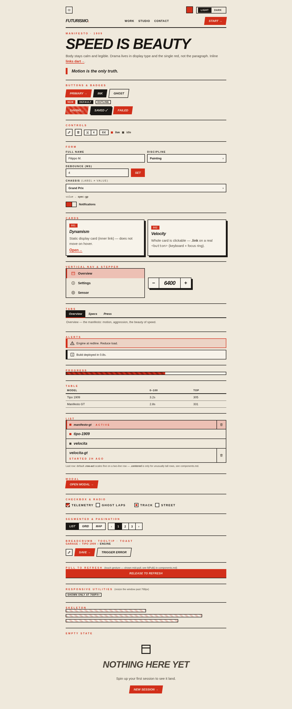
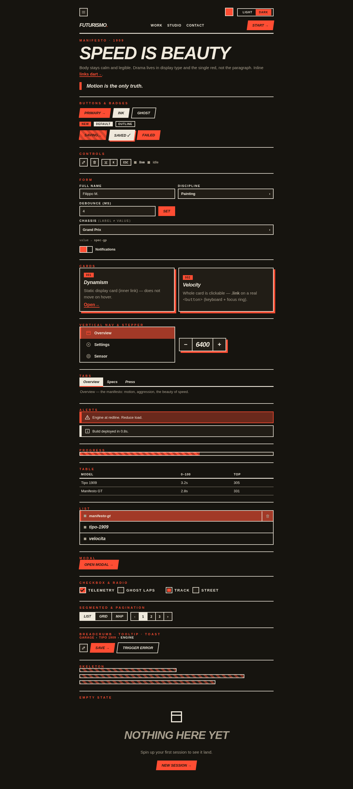

# futurism-design

A web design system with a strong point of view — **Paper Futurism**. Bold italic
display type, a single red accent, square corners, solid offset shadows, and fast
directional motion, in paired light and dark themes.

It ships a drop-in stylesheet + full component kit, plus a skill that keeps
generated UI on-brand instead of defaulting to generic styling.

## Preview

| Light | Dark |
|---|---|
|  |  |

**See it interactive** (toggle theme, swap the accent, open the custom select, switch tabs, open the modal):

- Live render: [open demo.html via htmlpreview](https://htmlpreview.github.io/?https://github.com/Stoica-Mihai/claude-skills/blob/main/plugins/futurism-design/skills/futurism-design/assets/demo.html)
- Or locally: open `skills/futurism-design/assets/demo.html` in a browser. It loads the shipped `futurism.css` + `futurism.js`, so it doubles as an integration test.

> GitHub sanitizes HTML/CSS/JS in Markdown, so the kit can't run inline here — the
> previews above are screenshots of the real `demo.html`, and the links render it live.

## Install

```
/plugin install futurism-design@claude-skills
```

## Use

Invoke explicitly with `/futurism-design`, or just ask for on-brand web UI in a
project that has adopted the system. Web-only (no TUI/CLI).

To use the kit directly:

```html
<link rel="stylesheet" href="futurism.css">
<script src="futurism.js" defer></script>
<!-- light is default; for dark: <html data-theme="dark"> -->
```

Both files are in [`skills/futurism-design/assets/`](skills/futurism-design/assets/).

## The eight laws

1. **Square corners always** — `border-radius: 0`.
2. **Solid offset shadows, never blur** — `box-shadow: 6px 6px 0 var(--shadow)` (clipped by `overflow:auto/hidden` ancestors — keep them `visible`).
3. **2px ink borders** on surfaces and controls.
4. **One accent only** — red carries links, CTAs, rules, highlights.
5. **Motion is machine** — fast, directional, eased; never springy/bouncy. Respects `prefers-reduced-motion`.
6. **Skewed CTAs** — `skewX(-8deg)` with counter-skewed label.
7. **Never trust native form popups** — build custom controls (e.g. the `.sel` select).
8. **Theme native `<button>` explicitly** — buttons don't inherit `color`; set `color`/`background` from tokens.

## Components

nav · buttons (primary/ink/ghost + loading/ok/err states) · icon button · keycap ·
keyboard chord · badges (red/default/outline) · input · form row · checkbox · radio ·
custom select (label≠value via `data-value`) · animated toggle · segmented control ·
status dot · cards · list rows · tabs · alerts (warn/info) · striped progress ·
skeleton · table · pagination · breadcrumb · tooltip · blockquote · darting links ·
modal (`<dialog>`) · toast · off-canvas drawer · empty state · runtime accent picker.

Built for apps as well as pages — modals, toasts, forms (real native checkbox/radio),
interactive states, mobile drawers, keyboard-accessible focus rings, and a
theme-independent `--scrim` for overlays. See SKILL.md's "Responsive & touch"
section for the layout patterns.

Token tables and full markup: [`skills/futurism-design/references/`](skills/futurism-design/references/).

## License

MIT
